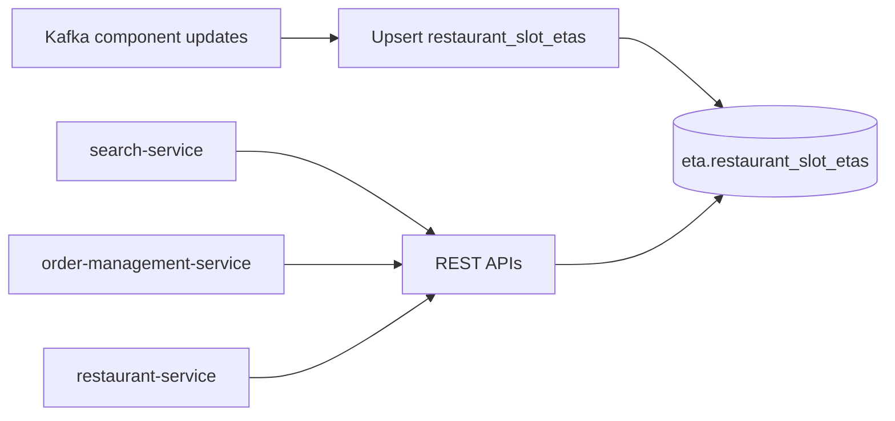

# Restaurant slot ETA schema

Mongo is already the store ([`config/application.yaml`](config/application.yaml) database `eta`). No domain models exist yet. This plan is **schema only** — one collection, document grain you chose, fields derived from your formula.

```
totalETA = lastMileTravel
         + acceptanceTime
         + max(prepTime, assignmentTime + firstMileTime + pickupTime)
         [+ buffer | rainBoost]   // applied at read time, not stored per slot
```



## Collection: `restaurant_slot_etas`

**One document** = one restaurant + one weekday + one meal slot.

**Natural key:** `(restaurant_id, day_of_week, time_slot)` — unique. Use a string `_id` of `{restaurant_id}:{day_of_week}:{time_slot}` so Kafka upserts are idempotent (`replaceOne` / `updateOne` with upsert on `_id`).

| Field | Type | Why |
|---|---|---|
| `_id` | string | `{restaurantId}:monday:lunch` |
| `restaurant_id` | string | Lookup key for all three downstreams |
| `day_of_week` | enum | `monday` … `sunday` |
| `time_slot` | enum | `breakfast` \| `lunch` \| `dinner` |
| `last_mile_travel_mins` | int | Customer last-mile |
| `acceptance_time_mins` | int | Restaurant accept |
| `prep_time_mins` | int | Kitchen; restaurant-service will read this |
| `assignment_time_mins` | int | Rider assign |
| `first_mile_time_mins` | int | Rider to restaurant |
| `pickup_time_mins` | int | Handoff at restaurant |
| `total_eta_mins` | int | Derived; what search/OMS usually return |
| `source` | string | e.g. `kafka` / `backfill` |
| `updated_at` | datetime | Freshness for consumers |

**Do not store** rain boost or surface buffers on this document. Rain is live; search vs order buffers differ. Keep this row as the **base** ETA. Apply `buffer` / `rainBoost` in the API layer when a caller asks.

**`total_eta_mins` write rule** (compute in the Kafka consumer before upsert, so readers do not recompute):

```
total = last_mile_travel_mins
      + acceptance_time_mins
      + max(prep_time_mins, assignment_time_mins + first_mile_time_mins + pickup_time_mins)
```

Example document:

```json
{
  "_id": "rest_123:monday:lunch",
  "restaurant_id": "rest_123",
  "day_of_week": "monday",
  "time_slot": "lunch",
  "last_mile_travel_mins": 12,
  "acceptance_time_mins": 2,
  "prep_time_mins": 18,
  "assignment_time_mins": 3,
  "first_mile_time_mins": 8,
  "pickup_time_mins": 2,
  "total_eta_mins": 32,
  "source": "kafka",
  "updated_at": "2026-08-18T10:00:00Z"
}
```

(`12 + 2 + max(18, 3+8+2) = 32`)

## Indexes

- **Unique:** `{ restaurant_id: 1, day_of_week: 1, time_slot: 1 }` (redundant if `_id` is the composite, but keeps queries off `_id` string parsing)
- **Search batch:** `{ day_of_week: 1, time_slot: 1, restaurant_id: 1 }` — `find({ day_of_week, time_slot, restaurant_id: { $in: [...] } })`

No TTL. These rows are standing estimates overwritten by Kafka.

## Slot windows (code constants, not a collection)

Resolve “now” → slot in the API if callers omit `day` / `slot` (typical for search). Suggested defaults (adjust later):

- `breakfast`: 07:00–11:00
- `lunch`: 11:00–16:00
- `dinner`: 16:00–23:00

Outside windows: use the nearest slot or return `404` — decide at API time.

## How downstreams read it

| Consumer | Query | Typical response |
|---|---|---|
| search-service | batch `restaurant_id` + current day/slot | `{ restaurant_id, total_eta_mins }` |
| order-management-service | one `restaurant_id` + day/slot | `total_eta_mins` (+ components if OMS needs SLA breakdown) |
| restaurant-service | one `restaurant_id` + day/slot | `prep_time_mins` (and optionally full document) |

APIs are out of scope for this schema step; they map 1:1 to the unique key or the batch index above.

## Kafka write path (assumption)

Until topics exist: treat each event as a **full or partial component snapshot** for `(restaurant_id, day, slot)`. Consumer loads existing row if partial, merges fields, recomputes `total_eta_mins`, upserts. Missing components default to `0` on first insert.

## Later (not in this schema)

- Go structs + collection name constants in `internal/types` / `internal/constants`
- Wire domain repository to the existing generic Mongo repo in [`internal/dataclients/mongo/repository.go`](internal/dataclients/mongo/repository.go)
- Kafka config/consumer
- Surface buffers / rain as request-time additives
